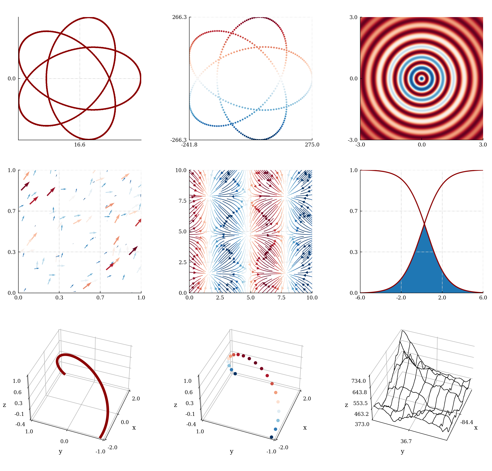

Figures
=======

Figures must be included in ``source/figures`` and referenced
by their path **relative to the current reStructuredText file**.
Sphinx has two figure directives: ``image`` and ``figure``.

``image``
---------

Uncaptioned figures. Allow side-by-side arrangements.
    
.. code-block:: reStructuredText

    # Single image
    .. image:: ../../figures/demo.png

    # Side by side arrangement
    |pic1| |pic2|

    .. |pic1| image:: ../../figures/demo.png
    :width: 45%

    .. |pic2| image:: ../../figures/demo.png
    :width: 45%

Single image:

----

Side by side:

.. rst-class:: center
    
    |pic1|    |pic2|

``figure``
----------

Captioned figures. Do not allow side-by-side arrangements.

.. code-block:: reStructuredText

    # Figure without caption
    .. figure:: ../../figures/demo.png
        :width: 50%
        :align: center

    # Figure with caption, labeled "figure1"
    .. _figure1:
    .. figure:: ../../figures/demo.png
        :width: 50%
        :align: center

        Caption

Figure without caption or label.

----

.. _figure1:

    Captioned and labelled figure.